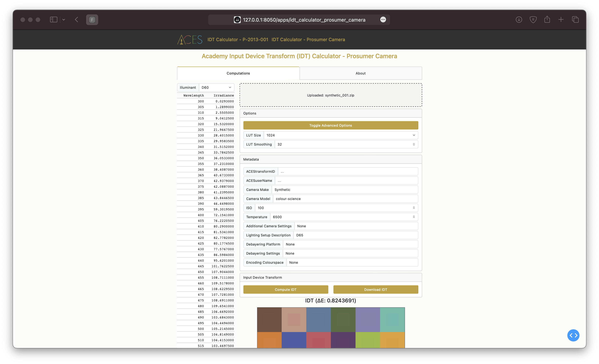
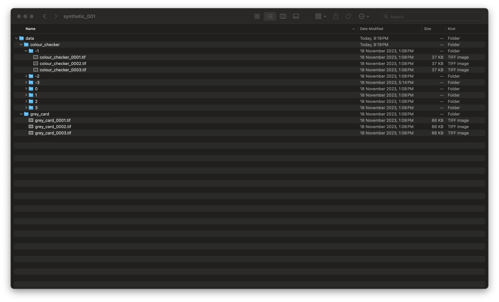

# Input Device Transform Calculator Apps

## Table of Contents
1. [Introduction](#introduction)
2. [Package Contents](#package-contents)
3. [Prerequisites](#prerequisites)
4. [Installation](#installation)
5. [Usage](#usage)
6. [License](#license)

## Introduction

This repository contains the source for the Academy Input Device Transform (IDT)
online Apps:

[Academy Input Device Transform (IDT) Calculator - P-2013-001](https://beta.devtools.acescentral.com/apps/idt_calculator_p_2013_001)


[Academy Input Device Transform (IDT) Calculator - Prosumer Camera](https://beta.devtools.acescentral.com/apps/idt_calculator_prosumer_camera)


## Package Contents

* [`aces/`](./aces) - *Python* package containing the API code.
* [`apps/`](./apps) - *Python* package of the online Apps.
* [`assets/`](./assets) - Assets, e.g. CSS files for the online Apps.
* [`docs/`](./docs) - Documentation for the API code.

## Prerequisites

### Docker (Users)

[Docker](https://www.docker.com) is the only requirement to run the Apps locally. 

#### Python & Poetry (Developers)

[Poetry](https://python-poetry.org) is recommended for developers willing to contribute to the project.
The [`pyproject.toml`](./pyproject.toml) file defines the various packages required.
It is also possible to use the [`requirements.txt`](./requirements.txt) file to generate a virtual environment with all the dependencies.

## Installation

### Docker (Users)

```bash
$ docker build --platform=linux/amd64 \
-t ampas/ampas-apps:latest \
-t ampas/ampas-apps:latest-amd64 .
```

The apps can then be launched locally as follows:

```bash
$ docker run -d \ 
--name=ampas-apps
-p 8010:8000 ampas/ampas-apps:latest-amd64
```

#### Python & Poetry (Developers)

```bash
$ poetry install
```

The Apps can then be launched locally as follows:

```bash
$ poetry run python index.py
```

or

```bash
$ poetry run invoke docker-run
```

## Usage

Each App has an `About` tab describing the given App and its usage.

### Prosumer Camera IDT Archive

The IDT App for Prosumer Cameras requires a Zip archive file, i.e. IDT archive, with a specific structure and content.

### Explicit Specification

The explicit specification of the IDT archive requires a root JSON file describing the paths to the various image sequences.


The root JSON file describes which image sequences correspond to which exposure value, flatfield and grey card.


The JSON schema for the IDT archive can be used to validate a new user file using a [validator](http://www.jsonschemavalidator.net/) and is defined as follows:

```json
{
    "$schema": "http://json-schema.org/draft-04/schema#",
    "type": "object",
    "properties": {
        "header": {
            "type": "object",
            "properties": {
                "schema_version": {
                    "type": "string"
                },
                "camera": {
                    "type": "string"
                },
                "manufacturer": {
                    "type": "string"
                },
                "exposure_settings": {
                    "type": "string"
                },
                "debayer_settings": {
                    "type": "string"
                },
                "output_description": {
                    "type": "string"
                },
                "lighting_description": {
                    "type": "string"
                }
            },
            "required": [
                "schema_version",
                "camera"
            ]
        },
        "data": {
            "type": "object",
            "properties": {
                "colour_checker": {
                    "type": "object",
                    "patternProperties": {
                        "-10": {
                            "type": "array",
                            "items": [{
                                "type": "string"
                            }]
                        },
                        "-9": {
                            "type": "array",
                            "items": [{
                                "type": "string"
                            }]
                        },
                        "-8": {
                            "type": "array",
                            "items": [{
                                "type": "string"
                            }]
                        },
                        "-7": {
                            "type": "array",
                            "items": [{
                                "type": "string"
                            }]
                        },
                        "-6": {
                            "type": "array",
                            "items": [{
                                "type": "string"
                            }]
                        },
                        "-5": {
                            "type": "array",
                            "items": [{
                                "type": "string"
                            }]
                        },
                        "-4": {
                            "type": "array",
                            "items": [{
                                "type": "string"
                            }]
                        },
                        "-3": {
                            "type": "array",
                            "items": [{
                                "type": "string"
                            }]
                        },
                        "-2": {
                            "type": "array",
                            "items": [{
                                "type": "string"
                            }]
                        },
                        "-1": {
                            "type": "array",
                            "items": [{
                                "type": "string"
                            }]
                        },
                        "0": {
                            "type": "array",
                            "items": [{
                                "type": "string"
                            }]
                        },
                        "1": {
                            "type": "array",
                            "items": [{
                                "type": "string"
                            }]
                        },
                        "2": {
                            "type": "array",
                            "items": [{
                                "type": "string"
                            }]
                        },
                        "3": {
                            "type": "array",
                            "items": [{
                                "type": "string"
                            }]
                        },
                        "4": {
                            "type": "array",
                            "items": [{
                                "type": "string"
                            }]
                        },
                        "5": {
                            "type": "array",
                            "items": [{
                                "type": "string"
                            }]
                        },
                        "6": {
                            "type": "array",
                            "items": [{
                                "type": "string"
                            }]
                        },
                        "7": {
                            "type": "array",
                            "items": [{
                                "type": "string"
                            }]
                        },
                        "8": {
                            "type": "array",
                            "items": [{
                                "type": "string"
                            }]
                        },
                        "9": {
                            "type": "array",
                            "items": [{
                                "type": "string"
                            }]
                        },
                        "10": {
                            "type": "array",
                            "items": [{
                                "type": "string"
                            }]
                        }
                    },
                    "additionalProperties": false
                },
                "flatfield": {
                    "type": "array",
                    "items": [{
                        "type": "string"
                    }]
                },
                "grey_card": {
                    "type": "array",
                    "items": [{
                        "type": "string"
                    }]
                }
            },
            "required": [
                "colour_checker"
            ]
        }
    },
    "required": [
        "header",
        "data"
    ]
}
```

### Implicit Specification

The implicit specification of the IDT archive requires that the image sequences are stored in specific directories that match the JSON schema:



The implicit specification cannot represent some of the metadata that the explicit specification supports, e.g. `manufacture` or `exposure_settings`.

## License

The Input Device Transform Calculators are provided by the Academy under the following terms and conditions:

Copyright © 2021 Academy of Motion Picture Arts and Sciences ("A.M.P.A.S."). Portions contributed by others as indicated. All rights reserved.

A worldwide, royalty-free, non-exclusive right to copy, modify, create derivatives, and use, in source and binary forms, is hereby granted, subject to acceptance of this license. Performance of any of the aforementioned acts indicates acceptance to be bound by the following terms and conditions:

Copies of source code, in whole or in part, must retain the above copyright notice, this list of conditions and the Disclaimer of Warranty.

Use in binary form must retain the above copyright notice, this list of conditions and the Disclaimer of Warranty in the documentation and/or other materials provided with the distribution.

Nothing in this license shall be deemed to grant any rights to trademarks, copyrights, patents, trade secrets or any other intellectual property of A.M.P.A.S. or any contributors, except as expressly stated herein.

Neither the name "A.M.P.A.S." nor the name of any other contributors to this software may be used to endorse or promote products derivative of or based on this software without express prior written permission of A.M.P.A.S. or the contributors, as appropriate.

This license shall be construed pursuant to the laws of the State of California, and any disputes related thereto shall be subject to the jurisdiction of the courts therein.

Disclaimer of Warranty: THIS SOFTWARE IS PROVIDED BY A.M.P.A.S. AND CONTRIBUTORS "AS IS" AND ANY EXPRESS OR IMPLIED WARRANTIES, INCLUDING, BUT NOT LIMITED TO, THE IMPLIED WARRANTIES OF MERCHANTABILITY, FITNESS FOR A PARTICULAR PURPOSE, AND NON-INFRINGEMENT ARE DISCLAIMED. IN NO EVENT SHALL A.M.P.A.S., OR ANY CONTRIBUTORS OR DISTRIBUTORS, BE LIABLE FOR ANY DIRECT, INDIRECT, INCIDENTAL, SPECIAL, EXEMPLARY, RESITUTIONARY, OR CONSEQUENTIAL DAMAGES (INCLUDING, BUT NOT LIMITED TO, PROCUREMENT OF SUBSTITUTE GOODS OR SERVICES; LOSS OF USE, DATA, OR PROFITS; OR BUSINESS INTERRUPTION) HOWEVER CAUSED AND ON ANY THEORY OF LIABILITY, WHETHER IN CONTRACT, STRICT LIABILITY, OR TORT (INCLUDING NEGLIGENCE OR OTHERWISE) ARISING IN ANY WAY OUT OF THE USE OF THIS SOFTWARE, EVEN IF ADVISED OF THE POSSIBILITY OF SUCH DAMAGE.

WITHOUT LIMITING THE GENERALITY OF THE FOREGOING, THE ACADEMY SPECIFICALLY DISCLAIMS ANY REPRESENTATIONS OR WARRANTIES WHATSOEVER RELATED TO PATENT OR OTHER INTELLECTUAL PROPERTY RIGHTS IN THE RAW TO ACES UTILITY REFERENCE IMPLEMENTATION, OR APPLICATIONS THEREOF, HELD BY PARTIES OTHER THAN A.M.P.A.S., WHETHER DISCLOSED OR UNDISCLOSED.