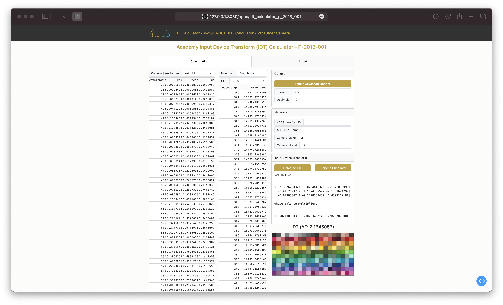
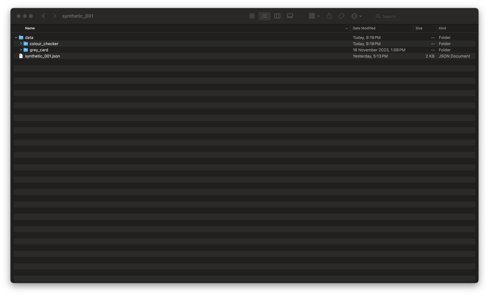

# ACES Input Device Transform Calculator Apps

[](https://cla-assistant.io/ampas/idt-calculator)

## Table of Contents

1. [Introduction](#introduction)
2. [Package Contents](#package-contents)
3. [Prerequisites](#prerequisites)
4. [Installation](#installation)
5. [Usage](#usage)
6. [License](#license)

## Introduction

This repository contains the source for the Academy Input Device Transform (IDT)
online Apps:

[Academy Input Device Transform (IDT) Calculator - P-2013-001](https://beta.devtools.acescentral.com/apps/idt_calculator_p_2013_001)


[Academy Input Device Transform (IDT) Calculator - Prosumer Camera](https://beta.devtools.acescentral.com/apps/idt_calculator_prosumer_camera)


## Package Contents

- [`aces/`](./aces) - _Python_ package containing the API code.
- [`apps/`](./apps) - _Python_ package of the online Apps.
- [`assets/`](./assets) - Assets, e.g. CSS files for the online Apps.
- [`docs/`](./docs) - Documentation for the API code.

## Prerequisites

### Docker (Users)

[Docker](https://www.docker.com) is the only requirement to run the Apps locally.

#### Python & Poetry (Developers)

[Poetry](https://python-poetry.org) is recommended for developers willing to contribute to the project.
The [`pyproject.toml`](./pyproject.toml) file defines the various packages required.
It is also possible to use the [`requirements.txt`](./requirements.txt) file to generate a virtual environment with all the dependencies.

## Installation

### Docker (Users)

```bash
$ docker build --platform=linux/amd64 \
-t ampas/ampas-apps:latest \
-t ampas/ampas-apps:latest-amd64 .
```

The apps can then be launched locally as follows:

```bash
$ docker run -d \
--name=ampas-apps \
-p 8010:8000 ampas/ampas-apps:latest-amd64
```

#### Python & Poetry (Developers)

```bash
$ poetry install
```

The Apps can then be launched locally as follows:

```bash
$ poetry run python index.py
```

or

```bash
$ poetry run invoke docker-run
```

## Usage

Each App has an `About` tab describing the given App and its usage.

### Prosumer Camera IDT Archive

The IDT App for Prosumer Cameras requires a Zip archive file, i.e. IDT archive, with a specific structure and content.

### Explicit Specification

The explicit specification of the IDT archive requires a root JSON file describing the paths to the various image sequences.



The root JSON file describes which image sequences correspond to which exposure value, flatfield and grey card.


The JSON schema for the IDT archive can be used to validate a new user file using a [validator](http://www.jsonschemavalidator.net/) and is defined as follows:

```json
{
  "$schema": "http://json-schema.org/draft-04/schema#",
  "type": "object",
  "properties": {
    "header": {
      "type": "object",
      "properties": {
        "schema_version": {
          "type": "string"
        },
        "aces_transform_id": {
          "type": "string"
        },
        "aces_user_name": {
          "type": "string"
        },
        "camera_make": {
          "type": "string"
        },
        "camera_model": {
          "type": "string"
        },
        "iso": {
          "type": "number"
        },
        "temperature": {
          "type": "number"
        },
        "additional_camera_settings": {
          "anyOf": [{ "type": "string" }, { "type": "null" }]
        },
        "lighting_setup_description": {
          "anyOf": [{ "type": "string" }, { "type": "null" }]
        },
        "debayering_platform": {
          "anyOf": [{ "type": "string" }, { "type": "null" }]
        },
        "debayering_settings": {
          "anyOf": [{ "type": "string" }, { "type": "null" }]
        },
        "encoding_colourspace": {
          "anyOf": [{ "type": "string" }, { "type": "null" }]
        }
      },
      "required": ["schema_version", "camera_make", "camera_model"]
    },
    "data": {
      "type": "object",
      "properties": {
        "colour_checker": {
          "type": "object",
          "patternProperties": {
            "[+-]?[0-9]+[.]?[0-9]*([e][+-]?[0-9]+)?": {
              "type": "array",
              "items": [
                {
                  "type": "string"
                }
              ]
            }
          },
          "additionalProperties": false
        },
        "flatfield": {
          "type": "array",
          "items": [
            {
              "type": "string"
            }
          ]
        },
        "grey_card": {
          "type": "array",
          "items": [
            {
              "type": "string"
            }
          ]
        }
      },
      "required": ["colour_checker"]
    }
  },
  "required": ["header", "data"]
}
```

#### Floating Point Exposure Values

Floating point exposure values are also supported as keys in the JSON file:


### Implicit Specification

The implicit specification of the IDT archive requires that the image sequences are stored in specific directories that match the JSON schema:


The implicit specification cannot represent some of the metadata that the explicit specification supports, e.g. `manufacture` or `exposure_settings`.

#### Floating Point Exposure Values

It is also possible to use floating point exposure values by naming the directories accordingly:


## License

This project is licensed under the terms of the [LICENSE](./LICENSE.md) agreement.

## Contributing

Thank you for your interest in contributing to our project. Before any contributions can be accepted, we require contributors to sign a Contributor License Agreement (CLA) to ensure that the project can freely use your contributions. You can find more details and instructions on how to sign the CLA in the [CONTRIBUTING.md](./CONTRIBUTING.md) file.

## Support

For support, please visit [ACESCentral.com](https://acescentral.com)
